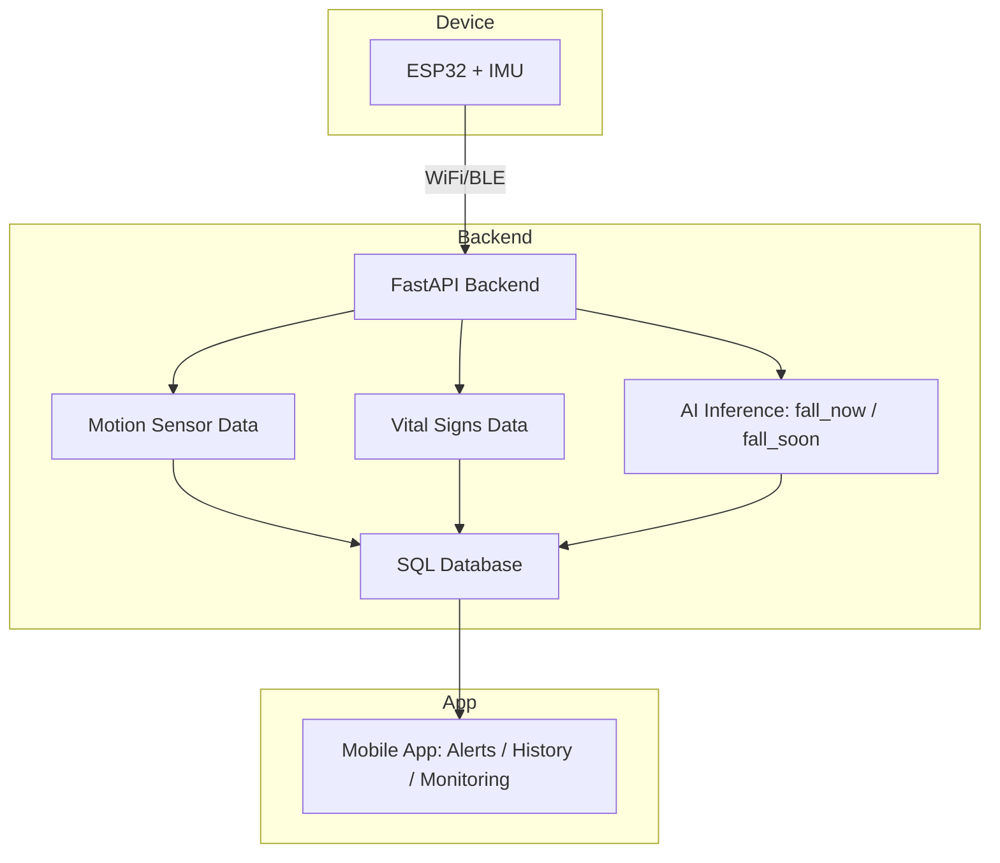
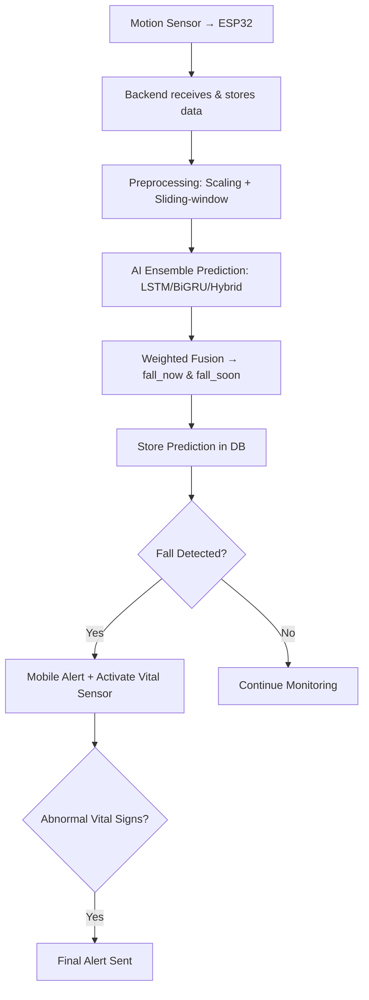

# 📘 AI-Based Fall Detection System (End-to-End)

[](https://www.python.org/)
[](https://fastapi.tiangolo.com/)
[](https://www.tensorflow.org/)
[](https://www.mysql.com/)

End-to-end **AI Fall Detection System** predicting **fall_now** and **fall_soon** using LSTM, BiGRU, and Hybrid models.

---

# 🚀 Features

### 🧠 AI & ML
- Ensemble: **LSTM + BiGRU + Hybrid (BiGRU-LSTM)**  
- Multi-task outputs: **fall_now**, **fall_soon**  
- Sliding-window (50 timesteps) + StandardScaler  
- Weighted model fusion + real-time prediction

### ⚙️ Backend
- FastAPI, MySQL integration, motion & vital data, prediction logging

### 💓 Vital Signs
- Sample every 30 min  
- Activate sensor 1 min if abnormal  
- Alert if still abnormal

### 🔌 Hardware (Next)
- ESP32 + IMU, WiFi/BLE streaming

### 📱 Mobile App (Next)
- Live alerts, history, dashboard

---

# 🧱 System Architecture (3D-like Interactive)



---

# 🔄 Workflow (3D Interactive)



---

# 📁 Project Structure

```
AI/
├── dataset/DataSet.csv
├── models/
│   ├── FINAL_LSTM_Attention.keras
│   ├── FINAL_BiGRU_Attention.keras
│   └── FINAL_BiGRU_Attention_LSTM.keras
├── scaler/scaler_all.save
├── train_scripts/
│   ├── train_all.py
│   └── ensemble_predict.py
└── inference/predictor.py

Backend/
├── app/
│   ├── ai_model.py
│   ├── crud.py
│   ├── database.py
│   ├── main.py
│   ├── models.py
│   ├── schemas.py
│   ├── simulate_sensor.py
│   └── routes/
│       ├── motions.py
│       ├── predictions.py
│       ├── users.py
│       ├── vitals.py
│       └── predict.py
└── test/test_full_system.py

MobileApp/ (coming soon)
```

---

# 🧪 AI Models <a name="ai-models"></a>

- **LSTM + Attention**: Bidirectional LSTM, Residual connections, Custom attention  
- **BiGRU + Attention**: 2 BiGRU layers, Normalization + Dropout, Attention pooling  
- **Hybrid BiGRU-LSTM**: GRU → LSTM stacked, Residual fusion

### 🎛 Ensemble Fusion
```python
weights = {"m1": 0.5, "m2": 0.2, "m3": 0.3}
ensemble = (p1*m1 + p2*m2 + p3*m3)
```

---

# ⚙️ Backend <a name="backend"></a>

**Users:** POST `/users/`, GET `/users/{id}`  
**Motion Sensor:** POST `/motions/`  
**Vitals:** POST `/vitals/`  
**Prediction:** POST `/predict/`  
**History:** GET `/predictions/{user_id}`

---

# 💓 Vital Signs <a name="vital-signs"></a>

- Sample every 30 min  
- Activate 1 min if abnormal  
- Send final alert if still abnormal

---

# 🔌 Hardware <a name="hardware"></a>

- ESP32 + IMU (MPU6050/9250)  
- WiFi/BLE streaming to backend

---

# 📱 Mobile App <a name="mobile-app">

- Live alerts  
- History visualization  
- Real-time dashboard

---

# ▶️ Running the Project

```bash
pip install -r requirements.txt
uvicorn app.main:app --reload
python app/simulate_sensor.py
```

---

# 💻 Installation

**Windows / MacOS / Linux**
```bash
git clone <repo-url>
cd <repo-folder>
pip install -r requirements.txt
```

---

# 🔧 Next Phase
- ESP32 firmware  
- IMU integration  
- BLE/WiFi real streaming  
- Mobile app ( React Native)

---

# 👥 Contributors
- Aysha Kassem 
- Nada Etman 
- Ali Tamer
- Abdelrahman Mostafa
- Mohamed Kamal

- Supervisor: Assoc. Prof. Dr. Wessam M.Salama

---

# ⭐ Support
Star ⭐ if you like this project!

